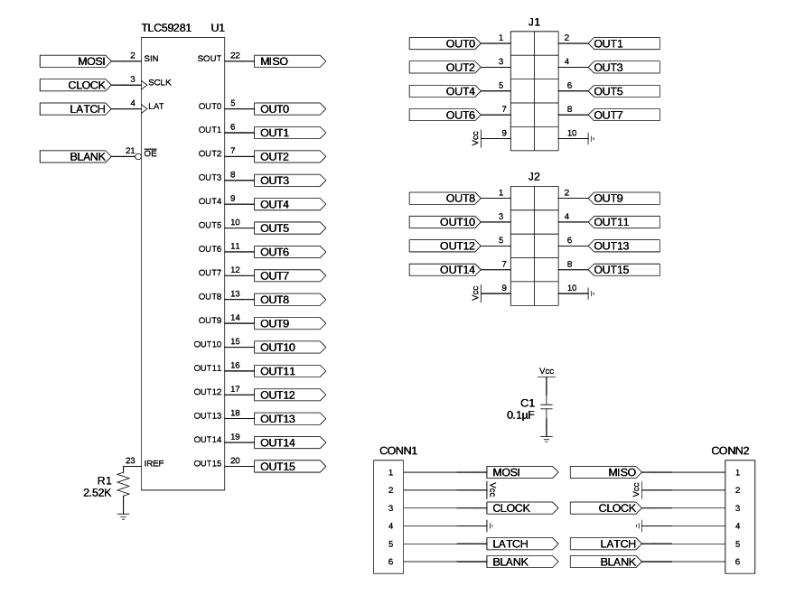
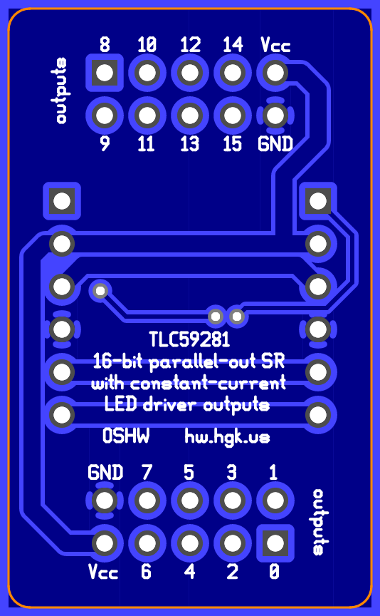

TLC59281(DBQ) 16-bit SIPO shift register with constant-current LED driver outputs
=================================================================================

This is a design for an augmented breakout for a TLC59281
serial-in/parallel-out 16-bit shift register with constant-current LED
driver output in the DBQ (QSOP-24) package.

Features
--------

*   Decoupling capacitor on board.
*   Reference resistor on board.
*   Dual 10-pin boxed headers, each providing connections to 8 output
    pins.
    *   The headers also have a Vcc pin and a ground pin, also, but
        these are mostly to aid in prototyping. Ensure that any current
        demands (on Vcc in particular) are modest in the final
        application, since they will likely be handled by ribbon cable.
        Provide a separate supply or ground connection where it makes
        sense.
*   The host-side 6-pin header provides power, serial, and blanking
    inputs to the board, while the compatible guest-side 6-pin header
    provides serial outputs and passed-through power and blanking
    outputs to the host-side header of another breakout (or to another
    TLC59281-based, 74HC595-based, or similar assembly).
*   Pre-fab and some-assembly-required options for cables for the header
    connectors are readily available.

Parts list
----------

*   1 x TLC59281DBQ (QSOP-24, SSOP-24, MO-137-AE)
*   2 x 6-pin header (100-mil centers)
*   2 x 10-pin boxed header (100-mil centers)
*   1 x 0.1µF capacitor (0603)
*   1 x reference resistor (0603)
    *   A resistance of 2.55kΩ is specified to cause live outputs to
        sink about 19.8mA. Refer to the TLC59281 data sheet for formulas
        and tolerances.

License
-------

The schematic and layout are to be used under the terms of the "Expat
License" (aka the OSI-approved "MIT license"), wherein the "Software"
refers to these files. The text follows:

> Copyright © 2016 Peter S. May
>
> Permission is hereby granted, free of charge, to any person obtaining
> a copy of this software and associated documentation files (the
> "Software"), to deal in the Software without restriction, including
> without limitation the rights to use, copy, modify, merge, publish,
> distribute, sublicense, and/or sell copies of the Software, and to
> permit persons to whom the Software is furnished to do so, subject to
> the following conditions:
>
> The above copyright notice and this permission notice shall be
> included in all copies or substantial portions of the Software.
>
> THE SOFTWARE IS PROVIDED "AS IS", WITHOUT WARRANTY OF ANY KIND,
> EXPRESS OR IMPLIED, INCLUDING BUT NOT LIMITED TO THE WARRANTIES OF
> MERCHANTABILITY, FITNESS FOR A PARTICULAR PURPOSE AND NONINFRINGEMENT.
> IN NO EVENT SHALL THE AUTHORS OR COPYRIGHT HOLDERS BE LIABLE FOR ANY
> CLAIM, DAMAGES OR OTHER LIABILITY, WHETHER IN AN ACTION OF CONTRACT,
> TORT OR OTHERWISE, ARISING FROM, OUT OF OR IN CONNECTION WITH THE
> SOFTWARE OR THE USE OR OTHER DEALINGS IN THE SOFTWARE.
